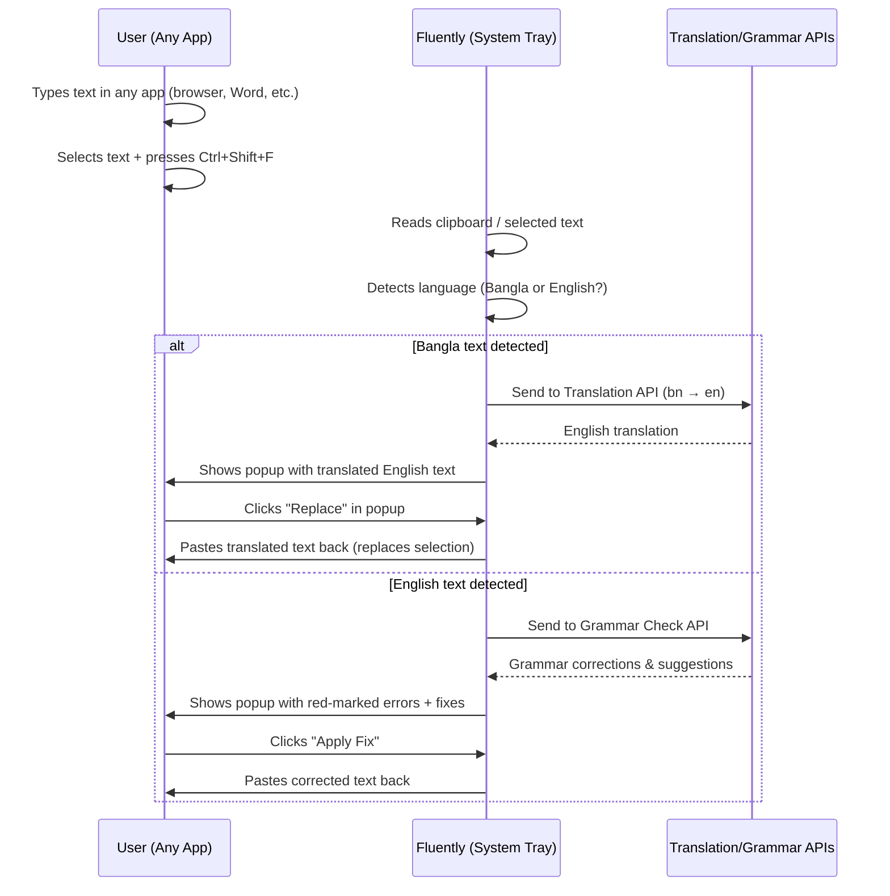
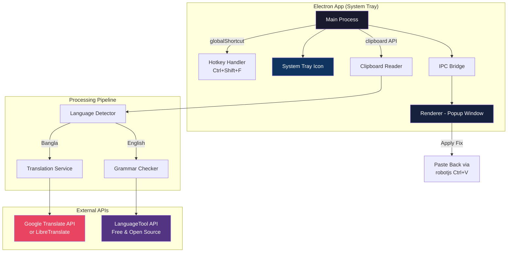

# Fluently — Bangla-English Writing Assistant

A free, global desktop application that helps Bangladeshi users communicate better in English — translating Bangla text to English and correcting English grammar, working everywhere on the desktop.

## How It Works (User Flow)



## Architecture Overview



## Technology Stack

| Component | Technology | Reason |
|-----------|-----------|--------|
| **Desktop Framework** | **Electron** | Mature ecosystem, full Node.js access, battle-tested for system tray apps. Easier than Tauri for rapid prototyping (no Rust needed) |
| **UI** | HTML/CSS/JS (Vanilla) | Lightweight popup — no need for React/Vue overhead |
| **Language Detection** | `franc` npm package | Lightweight, offline language detection (supports Bangla) |
| **Bangla → English Translation** | Google Cloud Translation API (free tier: 500K chars/month) or LibreTranslate (self-hosted, unlimited) | Best Bangla support |
| **Grammar Checking** | LanguageTool API (free, open source) | Industry standard, free tier available, supports self-hosting |
| **Keyboard Simulation** | `robotjs` or `@nut-tree/nut-js` | Simulates Ctrl+V to paste corrected text back into any app |
| **Build & Distribution** | `electron-builder` | Creates Windows installer (.exe / .msi) |

## User Review Required

> [!IMPORTANT]
> **API Key Strategy**: The Translation API (Google Cloud) requires an API key and has a free tier of 500K characters/month. For unlimited free usage, we can self-host LibreTranslate but it requires a server. Which approach do you prefer?
> 1. **Google Cloud Translation** — Easy setup, 500K chars/month free, then ~$20/million chars
> 2. **LibreTranslate (self-hosted)** — Free forever, but needs a server running locally or remotely
> 3. **MyMemory API** — Completely free, 5000 chars/day, no API key needed (good for MVP)

> [!WARNING]
> **Electron app size**: Electron bundles Chromium, so the installer will be ~120-200MB. If you want a lighter app (~5-10MB), we'd need to use **Tauri** instead, but that requires Rust knowledge. For MVP, Electron is the fastest path.

## Open Questions

1. **App Name**: I'm using "Fluently" — is this the name you want, or do you have another name in mind?
2. **Hotkey**: I'm planning `Ctrl+Shift+F` as the global hotkey. Any preference?
3. **Transliteration Support**: Should the app also handle Banglish (romanized Bangla like "ami banglay lekhbo") → English translation? This is harder than standard Bangla script translation.
4. **Offline Mode**: Should grammar checking work offline too? (We can embed LanguageTool locally but it adds ~200MB to the app)
5. **Auto-detect vs Manual Toggle**: Should the app auto-detect the language, or should the user manually choose "Translate" vs "Grammar Check"?

---

## Proposed Changes

### Phase 1 — Core Desktop Shell (MVP)

#### [NEW] `package.json`
- Electron app configuration
- Dependencies: `electron`, `electron-builder`, `franc` (language detection), `robotjs` (keyboard simulation)
- Scripts for dev, build, and package

#### [NEW] `src/main.js` — Electron Main Process
- App initialization with single instance lock
- System tray setup with icon and context menu (Show/Quit)
- Global shortcut registration (`Ctrl+Shift+F`)
- Clipboard reading on hotkey press
- Language detection using `franc`
- IPC communication with popup renderer
- Floating popup window creation (frameless, always-on-top, positioned near cursor)

#### [NEW] `src/preload.js` — Context Bridge
- Secure bridge between main and renderer process
- Exposes: `getSelectedText()`, `applyCorrection(text)`, `onTextAnalyzed(callback)`

#### [NEW] `src/popup/index.html` — Popup UI
- Frameless, rounded, floating popup window
- Two modes:
  - **Translation Mode**: Shows original Bangla → translated English with "Replace" button
  - **Grammar Mode**: Shows text with red underlines on errors, click to see suggestions
- Premium dark glassmorphism design with smooth animations
- Close on Escape or click outside

#### [NEW] `src/popup/styles.css` — Popup Styling
- Dark theme with glassmorphism (blur, transparency)
- Smooth slide-in animation
- Red underline styling for grammar errors
- Green highlight for corrections
- Responsive sizing based on content

#### [NEW] `src/popup/renderer.js` — Popup Logic
- Receives analyzed text from main process via IPC
- Renders translation results or grammar corrections
- Handles "Apply" button click → sends corrected text back to main process
- Handles keyboard shortcuts (Enter to apply, Escape to close)

---

### Phase 2 — Translation & Grammar Services

#### [NEW] `src/services/translator.js` — Translation Service
- Bangla → English translation via API
- Configurable backend (Google Cloud / LibreTranslate / MyMemory)
- Caching layer for repeated translations
- Error handling and fallback

#### [NEW] `src/services/grammar.js` — Grammar Checking Service
- English grammar checking via LanguageTool API
- Parses error positions, suggestions, and rule categories
- Groups errors by type (grammar, spelling, style, punctuation)

#### [NEW] `src/services/detector.js` — Language Detection
- Uses `franc` to detect if input is Bangla or English
- Handles mixed-language text
- Confidence threshold to avoid false positives

---

### Phase 3 — Text Replacement & Polish

#### [NEW] `src/services/paster.js` — Text Paste-Back Service
- Uses `robotjs` to simulate Ctrl+V
- Saves/restores original clipboard content
- Handles timing and focus management

#### [NEW] `src/settings/settings.html` — Settings Window
- API key configuration
- Hotkey customization
- Auto-start on Windows boot toggle
- Language preferences

#### [NEW] `assets/tray-icon.png` — System Tray Icon
- 16x16 and 32x32 icons for the system tray

---

### Phase 4 — Build & Distribution

#### [NEW] `electron-builder.yml` — Build Configuration
- Windows NSIS installer configuration
- Auto-update configuration
- App metadata (name, version, description)

---

## Project Structure

```
z:\Fluently\
├── package.json
├── electron-builder.yml
├── assets/
│   ├── tray-icon.png
│   ├── tray-icon@2x.png
│   └── icon.ico
├── src/
│   ├── main.js              # Electron main process
│   ├── preload.js            # Context bridge
│   ├── popup/
│   │   ├── index.html        # Floating popup UI
│   │   ├── styles.css        # Glassmorphism styling
│   │   └── renderer.js       # Popup logic
│   ├── settings/
│   │   ├── settings.html     # Settings window
│   │   ├── settings.css
│   │   └── settings.js
│   └── services/
│       ├── translator.js     # Bangla → English
│       ├── grammar.js        # Grammar checking
│       ├── detector.js       # Language detection
│       └── paster.js         # Clipboard paste-back
└── build/                    # Build output
```

## Verification Plan

### Automated Tests
- Unit tests for language detection (Bangla vs English vs mixed text)
- Unit tests for grammar service response parsing
- Integration test for clipboard read → detect → translate → paste flow

### Manual Verification
1. Type Bangla text in Notepad → press hotkey → verify popup shows translation
2. Type English text with grammar errors → press hotkey → verify red marks and suggestions
3. Click "Apply" → verify corrected text replaces original
4. Test across apps: Browser (Chrome), VS Code, MS Word, Notepad
5. Test system tray icon, context menu, and settings window
6. Test Windows auto-start on boot

### Dev Testing Commands
```bash
# Install dependencies
npm install

# Run in development mode
npm run dev

# Build Windows installer
npm run build
```
